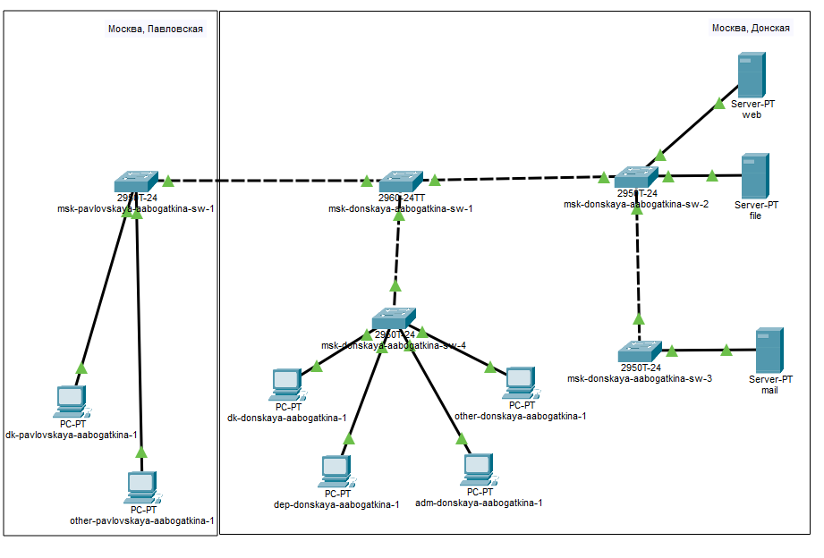

---
# Preamble

## Author
author:
  name: Богаткина Алёна Александровна 
  degrees: DSc
  email: 1132231437@pfur.ru
  affiliation:
    - name: Российский университет дружбы народов
      country: Российская Федерация
      postal-code: 117198
      city: Москва
      address: ул. Миклухо-Маклая, д. 6

## Title
title: Презентация по Лабораторной работе №4
subtitle: Администрирование Локальных Сетей
license: CC BY
date: 2026-03-03

## Generic options
lang: ru-RU
crossref:
  lof-title: Список иллюстраций
  lot-title: Список таблиц
  lol-title: Листинги

## Fonts 
mainfont: DejaVu Sans
romanfont: DejaVu Sans 
sansfont: DejaVu Sans 
monofont: DejaVu Sans Mono 
mainfontoptions: Ligatures=TeX 
romanfontoptions: Ligatures=TeX 
sansfontoptions: Ligatures=TeX,Scale=MatchLowercase 
monofontoptions: Scale=MatchLowercase,Scale=0.9

## Formats
format:
### Pdf output format
  beamer:
    toc: true
    toc-title: Содержание
    number-sections: true
    colorlinks: false
    toc-depth: 2
    slide_level: 2
    aspectratio: 169
    section-titles: true
    theme: metropolis
    themeoptions: progressbar=frametitle,sectionpage=progressbar,numbering=fraction
    pdf-engine: xelatex
    fontenc: T2A
#### Language
    babel-lang: russian
    babel-otherlangs: english

### Html output
  revealjs:
    transition: slide
    margin: 0.2
    smaller: false
    output-ext: html
    theme: beige
    logo: _resources/image/logo_rudn.png
---

# Вводная часть

## Цель работы

Провести подготовительную работу по первоначальной настройке коммутаторов сети.

## Задание

Требуется сделать первоначальную настройку коммутаторов сети, представленной на схеме L1 (из лабораторной работы №3). Под первоначальной настройкой понимается указание имени устройства, его IP-адреса, настройка доступа по паролю к виртуальным терминалам и консоли, настройка удалённого доступа к устройству по ssh. При выполнении работы необходимо учитывать соглашение об именовании

# Выполнение лабораторной работы

## Построение сети

{#fig-001 width=60%}

## Настройка коммутатора

Провели настройку коммутатора msk-donskaya-aabogatkina-sw-1 ([рис. @fig-002]), ([рис. @fig-003]), ([рис. @fig-004]), ([рис. @fig-005]), ([рис. @fig-006]), ([рис. @fig-007]), ([рис. @fig-008]) 

{#fig-002 width=70%}

## Настройка коммутатора

{#fig-003 width=70%}

## Настройка коммутатора

{#fig-004 width=70%}

## Настройка коммутатора

{#fig-005 width=70%}

## Настройка коммутатора

{#fig-006 width=50%}

## Настройка коммутатора

{#fig-007 width=30%}

## Настройка коммутатора

Провели настройку коммутатора msk-donskaya-aabogatkina-sw-2 ([рис. @fig-008]), ([рис. @fig-009]), ([рис. @fig-010]), ([рис. @fig-011]), ([рис. @fig-012]), ([рис. @fig-013])

{#fig-008 width=70%}

## Настройка коммутатора

{#fig-009 width=70%}

## Настройка коммутатора

{#fig-010 width=70%}

## Настройка коммутатора

{#fig-011 width=70%}

## Настройка коммутатора

{#fig-012 width=70%}

## Настройка коммутатора

{#fig-013 width=30%}

## Настройка коммутатора

Провели настройку коммутатора msk-donskaya-aabogatkina-sw-3 ([рис. @fig-014]), ([рис. @fig-015]), ([рис. @fig-016]), ([рис. @fig-017]), ([рис. @fig-018]), ([рис. @fig-019])

{#fig-014 width=70%}

## Настройка коммутатора

{#fig-015 width=70%}

## Настройка коммутатора

{#fig-016 width=70%}

## Настройка коммутатора

{#fig-017 width=70%}

## Настройка коммутатора

{#fig-018 width=60%}

## Настройка коммутатора

{#fig-019 width=40%}

## Настройка коммутатора

Провели настройку коммутатора msk-donskaya-aabogatkina-sw-4 ([рис. @fig-020]), ([рис. @fig-021]), ([рис. @fig-022]), ([рис. @fig-023]), ([рис. @fig-024]), ([рис. @fig-025])

{#fig-020 width=70%}

## Настройка коммутатора

{#fig-021 width=70%}

## Настройка коммутатора

{#fig-022 width=70%}

## Настройка коммутатора

{#fig-023 width=70%}

## Настройка коммутатора

{#fig-024 width=50%}

## Настройка коммутатора

{#fig-025 width=40%}

## Настройка коммутатора

Провели настройку коммутатора msk-pavlovskaya-aabogatkina-sw-1 ([рис. @fig-026]), ([рис. @fig-027]), ([рис. @fig-028]), ([рис. @fig-029]), ([рис. @fig-030]), ([рис. @fig-031])

{#fig-026 width=70%}

## Настройка коммутатора

{#fig-027 width=70%}

## Настройка коммутатора

{#fig-028 width=70%}

## Настройка коммутатора

{#fig-029 width=70%}

## Настройка коммутатора

{#fig-030 width=60%}

## Настройка коммутатора

{#fig-031 width=40%}

# Подведение итогов

## Выводы

В ходе выполнения лабораторной работы №4 мы провели подготовительную работу по первоначальной настройке коммутаторов сети

## Список литературы

1. [Лаборатораня работа №4](https://esystem.rudn.ru/pluginfile.php/3093886/mod_resource/content/4/004-net-config.pdf)
