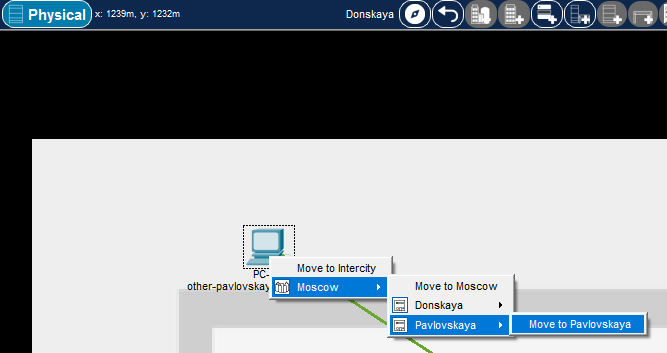
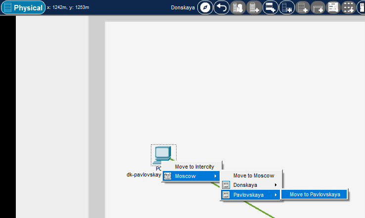
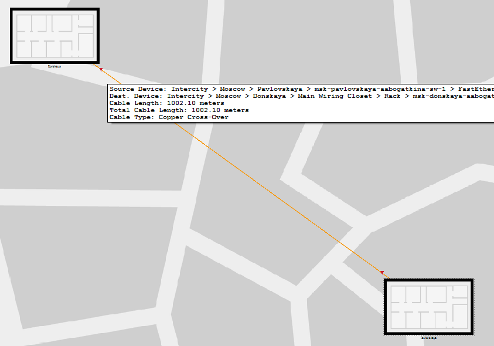

---
# Preamble

## Author
author:
  name: Богаткина Алёна Александровна 
  degrees: DSc
  email: 1132231437@pfur.ru
  affiliation:
    - name: Российский университет дружбы народов
      country: Российская Федерация
      postal-code: 117198
      city: Москва
      address: ул. Миклухо-Маклая, д. 6

## Title
title: Презентация по Лабораторной работе №7
subtitle: Администрирование Локальных Сетей
license: CC BY
date: 2026-03-26

## Generic options
lang: ru-RU
crossref:
  lof-title: Список иллюстраций
  lot-title: Список таблиц
  lol-title: Листинги

## Fonts 
mainfont: DejaVu Sans
romanfont: DejaVu Sans 
sansfont: DejaVu Sans 
monofont: DejaVu Sans Mono 
mainfontoptions: Ligatures=TeX 
romanfontoptions: Ligatures=TeX 
sansfontoptions: Ligatures=TeX,Scale=MatchLowercase 
monofontoptions: Scale=MatchLowercase,Scale=0.9

## Formats
format:
### Pdf output format
  beamer:
    toc: true
    toc-title: Содержание
    number-sections: true
    colorlinks: false
    toc-depth: 2
    slide_level: 2
    aspectratio: 169
    section-titles: true
    theme: metropolis
    themeoptions: progressbar=frametitle,sectionpage=progressbar,numbering=fraction
    pdf-engine: xelatex
    fontenc: T2A
#### Language
    babel-lang: russian
    babel-otherlangs: english

### Html output
  revealjs:
    transition: slide
    margin: 0.2
    smaller: false
    output-ext: html
    theme: beige
    logo: _resources/image/logo_rudn.png
---

# Вводная часть

## Цель работы

Получить навыки работы с физической рабочей областью Packet Tracer, а также учесть физические параметры сети.

## Задание

1. Заменить соединение между коммутаторами двух территорий msk-donskaya-aabogatkina-sw-1 и msk-pavlovskaya-aabogatkina-sw-1 на соединение, учитывающее физические параметры сети, а именно — расстояние между двумя территориями.
2. При выполнении работы необходимо учитывать соглашение об именовании.

# Выполнение лабораторной работы

## Проект предыдущей лабораторной работы

Открыли проект предыдущей лабораторной работы. ([рис. @fig-001])

{#fig-001 width=60%}

## Физическая область Packet Tracer

Перешли в физическую область Packet Tracer. Присвоили название городу - Moscow ([рис. @fig-002])

{#fig-002 width=40%}

## Физическая область Packet Tracer

Далее щёлкнув на изображении города, мы увидели изображение здания. Присвоили ему название Donskaya. Добавили здание для территории Pavlovskaya ([рис. @fig-003])

{#fig-003 width=50%}

## Физическая область Packet Tracer

Щёлкнув на изображении здания Donskaya, переместили изображение, обозначающее серверное помещение, в него ([рис. @fig-004])

{#fig-004 width=30%}

## Физическая область Packet Tracer

Щёлкнув на изображении серверной, мы увидели отображение серверных стоек ([рис. @fig-005])

{#fig-005 width=15%}

## Физическая область Packet Tracer

Далее переместили коммутатор msk-pavlovskaya-aabogatkina-sw-1 и два оконечных устройства dk-pavlovskaya-aabogatkina-1 и other-pavlovskaya-aabogatkina-1 на территорию Pavlovskaya ([рис. @fig-006]), ([рис. @fig-007]), ([рис. @fig-008]), ([рис. @fig-009])

{#fig-006 width=70%}

## Физическая область Packet Tracer

{#fig-007 width=70%}

## Физическая область Packet Tracer

{#fig-008 width=70%}

## Физическая область Packet Tracer

{#fig-009 width=70%}

## Логическая область Packet Tracer

Вернувшись в логическую рабочую область Packet Tracer, пропинговали с коммутатора msk-donskaya-aabogatkina-sw-1 коммутатор msk-pavlovskaya-aabogatkina-sw-1 и убедились в работоспособности соединения: ```ping 10.128.1.6``` ([рис. @fig-010])

{#fig-010 width=70%}

## Логическая область Packet Tracer

В меню "Options" -> "Preferences" во вкладке "Interface" активировали разрешение на учёт физических характеристик среды передачи (Enable Cable Length Effects) ([рис. @fig-011])

{#fig-011 width=70%}

## Физическая область Packet Tracer

В физической рабочей области Packet Tracer разместили две территории на расстоянии более 100 м друг от друга (рекомендуемое расстояние - около 1000 м или более) ([рис. @fig-012])

{#fig-012 width=50%}

## Логическая область Packet Tracer

Вернувшись в логическую рабочую область Packet Tracer, пропинговали с коммутатора msk-donskaya-aabogatkina-sw-1 коммутатор msk-pavlovskaya-aabogatkina-sw-1 и убедились в неработоспособности соединения ([рис. @fig-013])

{#fig-013 width=70%}

## Логическая область Packet Tracer

Удалили соединение между msk-donskaya-aabogatkina-sw-1 и msk-pavlovskaya-aabogatkina-sw-1. Добавили в логическую рабочую область два повторителя (RepeaterPT). Присвоили им соответствующие названия msk-donskaya-aabogatkina-mc-1 и msk-pavlovskaya-aabogatkina-mc-1

## Логическая область Packet Tracer

Заменили имеющиеся модули на PT-REPEATERNM-1FFE и PT-REPEATER-NM-1CFE для подключения оптоволокна и витой пары по технологии Fast Ethernet ([рис. @fig-014]), ([рис. @fig-015])

{#fig-014 width=70%}

## Логическая область Packet Tracer

{#fig-015 width=70%}

## Физическая область Packet Tracer

Переместили msk-pavlovskaya-aabogatkina-mc-1 на территорию Pavlovskaya (в физической рабочей области Packet Tracer) ([рис. @fig-016])

{#fig-016 width=70%}

## Логическая область Packet Tracer

Подключили коммутатор msk-donskaya-aabogatkina-sw-1 к msk-donskaya-aabogatkina-mc-1 по витой паре, msk-donskaya-aabogatkina-mc-1 и msk-pavlovskaya-aabogatkina-mc-1 - по оптоволокну, msk-pavlovskaya-sw-aabogatkina-1 к msk-pavlovskaya-aabogatkina-mc-1 -по витой паре ([рис. @fig-017]), ([рис. @fig-018])

## Логическая область Packet Tracer

{#fig-017 width=70%}

## Физическая область Packet Tracer

{#fig-018 width=70%}

## Логическая область Packet Tracer

Далее убедились в работоспособности соединения между msk-donskaya-aabogatkina-sw-1 и msk-pavlovskaya-aabogatkina-sw-1 ([рис. @fig-019])

{#fig-019 width=70%}

# Подведение итогов

## Выводы

В ходе выполнения лабораторной работы №7 мы получили навыки работы с физической рабочей областью Packet Tracer, а также учли физические параметры сети

## Список литературы

1. [Лабораторная работа №7](https://esystem.rudn.ru/pluginfile.php/3093900/mod_resource/content/4/007-physical-view.pdf)
