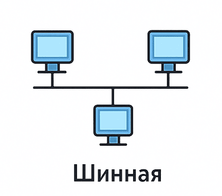
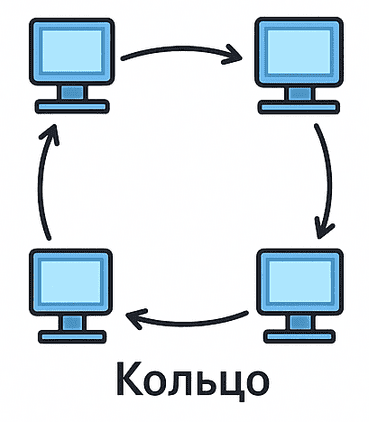
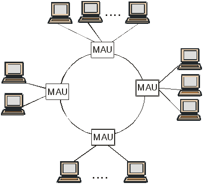
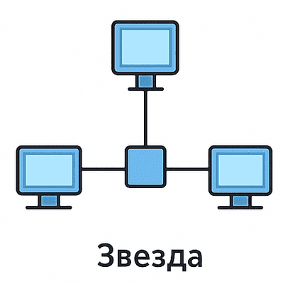
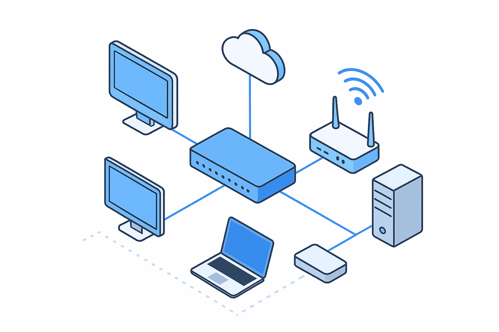

---
## Author
author:
  name:  Богаткина Алёна Александровна 
  degrees: DSc
  orcid: 0000-0002-0877-7063
  email: kulyabov-ds@rudn.ru
  affiliation:
    - name: Российский университет дружбы народов
      country: Российская Федерация
      postal-code: 117198
      city: Москва
      address: ул. Миклухо-Маклая, д. 6

## Title
title: Реферат на тему "Топология сети. Топологии типа «звезда», «кольцо», «шина»"
subtitle: Администрирование Локальных Сетей 
license: "CC BY"
---

# Введение

В современном мире компьютерные сети являются основой цифровой инфраструктуры — от небольшого офиса до глобального Интернета. Однако, прежде чем говорить о сложных протоколах маршрутизации или облачных технологиях, необходимо понять фундамент любой сети: её топологию. Топология определяет, как устройства соединяются друг с другом, как передаются данные и, что самое важное, как сеть ведёт себя в случае поломки или перегрузки.

Несмотря на то, что большинство современных локальных сетей строятся по принципу «звезды», а магистральные сети используют сложные гибридные структуры, классические топологии — «шина», «кольцо» и «звезда» — остаются теоретической основой сетевого администрирования. Понимание их сильных и слабых сторон позволяет правильно проектировать инфраструктуру, выбирать оборудование и прогнозировать риски.

**Цель данной работы** — провести детальный сравнительный анализ трёх базовых топологий компьютерных сетей, выявить их архитектурные особенности, преимущества, недостатки и области современного применения. ([рис. @fig-001])

{#fig-001 width=70%}

# Глава 1. Что такое топология?

Топология компьютерной сети — это способ физического или логического соединения узлов (компьютеров, серверов, коммутаторов, маршрутизаторов) друг с другом. Это своего рода «скелет» сети, определяющий структуру связей.

Важно различать два понятия: **физическую топологию** и **логическую топологию.**

- **Физическая топология** описывает реальное расположение кабелей, проводов и оборудования. Это то, как выглядит сеть с точки зрения монтажа.
- **Логическая топология** описывает пути передачи данных. Например, физически устройства могут быть подключены к одному коммутатору (звезда), но логически, если используется концентратор (хаб), данные распространяются на все порты, что соответствует логической шине.

Для анализа топологий используются четыре ключевых критерия:

1. **Отказоустойчивость** — способность сети сохранять работоспособность при выходе из строя одного узла или кабеля.
2. **Масштабируемость** — возможность лёгкого добавления новых узлов без ухудшения производительности.
3. **Стоимость развертывания** — оценивается по метражу кабеля и необходимости использования активного оборудования.
4. **Производительность** — зависит от количества коллизий и способности сети обрабатывать одновременный трафик.

# Глава 2. Топология «Шина»

## Архитектура и принцип работы

Топология «шина» является исторически первой широко распространённой топологией для локальных сетей. В её основе лежит единый кабель (обычно коаксиальный), к которому через специальные разъёмы подключаются все компьютеры сети. На концах кабеля обязательно устанавливаются терминаторы, которые поглощают электрический сигнал, не позволяя ему отражаться обратно.

Принцип работы основан на технологии **CSMA/CD** (Carrier Sense Multiple Access with Collision Detection — множественный доступ с контролем несущей и обнаружением коллизий). Упрощённо это выглядит так ([рис. @fig-002]):

1. Узел перед отправкой данных «слушает» кабель.
2. Если кабель свободен, узел начинает передачу.
3. Если два узла начинают передачу одновременно, происходит коллизия.
4. Узлы обнаруживают коллизию, прекращают передачу и возобновляют её через случайный промежуток времени.

{#fig-002 width=70%}

## Плюсы

Для своего времени топология «шина» обладала рядом неоспоримых преимуществ:

- **Экономичность**: расход кабеля был минимальным — для соединения N компьютеров требовалось всего N+1 сегментов кабеля.
- **Простота монтажа**: не требовалось дополнительных активных устройств (коммутаторов или концентраторов), что снижало порог входа для создания сети.
- **Пассивность**: выход из строя сетевой карты одного компьютера (если не происходит короткого замыкания) не нарушал работу остальных.

## Минусы

Несмотря на низкую стоимость, топология «шина» обладает критическими недостатками, которые привели к её отказу в современных сетях:

- **Низкая отказоустойчивость**: обрыв кабеля в любой точке или выход из строя терминатора приводит к полному параличу всей сети. Диагностика места обрыва крайне затруднена.
- **Проблема коллизий**: с ростом числа узлов количество коллизий растёт экспоненциально. При загрузке сети более 30–40% эффективная пропускная способность падает практически до нуля.
- **Проблемы безопасности**: все данные, передаваемые по шине, доступны всем узлам. В условиях современного мира это недопустимо.
- **Сложность масштабирования**: добавление нового компьютера требует остановки работы всей сети для монтажа нового отвода.

## Современное применение

В чистом виде топология «шина» в локальных сетях практически не используется. Её можно встретить лишь в устаревшем оборудовании или в специфических индустриальных решениях, таких как простые датчики, работающие по интерфейсу 1-Wire, где скорость передачи данных не критична, а требования к стоимости монтажа — жёсткие.

# Глава 3. Топология «Кольцо»

## Архитектура и протоколы

Топология «кольцо» предполагает, что каждый узел соединён с двумя соседними, образуя замкнутый контур. Данные передаются от одного узла к другому по кругу в одном направлении (реже в двух). Классическим воплощением этой топологии является стандарт Token Ring (IEEE 802.5), разработанный компанией IBM. ([рис. @fig-003])

{#fig-003 width=70%}

В сети Token Ring используется **маркерный доступ.** Маркер — это служебный кадр малого размера, который циркулирует по кольцу. Узел, желающий передать данные, должен дождаться свободного маркера, захватить его, присоединить к нему свой пакет данных и отправить в сеть. После того как пакет совершит полный круг и вернётся к отправителю, маркер освобождается и передаётся следующему узлу.

Важно отметить, что физически кольцо часто реализовывалось через концентратор (MAU — Multistation Access Unit), то есть внешне напоминало звезду, но логически оставалось кольцом. ([рис. @fig-004])

{#fig-004 width=70%}

## Плюсы

- **Отсутствие коллизий**: маркерный метод доступа исключает возможность столкновения данных, что обеспечивает стабильную работу даже при высокой нагрузке.
- **Равноправие узлов**: в отличие от звезды, где центральный узел может иметь приоритет, в кольце все узлы получают доступ к сети по очереди.
- **Высокая предсказуемость**: можно точно рассчитать максимальное время ожидания доступа.

## Минусы

- **Уязвимость**: в простом кольце выход из строя одного узла или обрыв кабеля разрывает всю сеть. Это требует внедрения сложных и дорогих механизмов резервирования.
- **Задержка**: каждый пакет проходит через все промежуточные узлы. При увеличении количества узлов задержка линейно растёт.
- **Сложность настройки**: оборудование для кольцевых топологий сложнее в конфигурации, чем обычные коммутаторы.

# Глава 4. Топология «Звезда»

## Архитектура

Топология «звезда» является безусловным доминантом в современных локальных сетях. В центре звезды находится активное сетевое устройство — коммутатор или, в устаревших вариантах, концентратор. Каждый компьютер или другое устройство подключается к коммутатору отдельным кабелем (обычно витой парой категории 5e или выше). ([рис. @fig-005])

{#fig-005 width=70%}

## Плюсы

- **Высокая отказоустойчивость**: выход из строя одного компьютера или обрыв его кабеля не влияет на работу остальных устройств. Это кардинально отличает звезду от шины или кольца.
- **Централизация управления и диагностики**: всё администрирование сводится к работе с коммутатором. Есть возможность видеть статус каждого порта, отключать проблемные сегменты или определять место обрыва кабеля без остановки всей сети.
- **Безопасность**: современные коммутаторы создают отдельный домен коллизий для каждого порта и передают данные только на порт назначения. Это исключает несанкционированный перехват трафика соседними узлами.
- **Масштабируемость**: для добавления нового узла достаточно проложить один кабель от коммутатора до рабочего места. При нехватке портов коммутаторы можно соединять между собой, наращивая сеть практически без ограничений.

## Минусы

- **Единая точка отказа**: центральный коммутатор является критическим звеном. Если он выйдет из строя, вся сеть прекратит работу. Для решения этой проблемы используют резервирование.
- **Высокий расход кабеля**: по сравнению с шиной, звезда требует значительно больше кабельной инфраструктуры.
- **Зависимость от активного оборудования**: для работы звезды необходимо наличие коммутатора или концентратора, а также, в случае PoE (Power over Ethernet), источника питания для удалённых устройств.

# Глава 5. Сравнительный анализ

Для наглядного сравнения трёх рассмотренных топологий сведём их характеристики в таблицу (табл. \ref{table:table})

\begin{table}[H]
\centering
\footnotesize
\caption{Шина vs Кольцо vs Звезда}
\label{table:table}
\begin{tabular}{|p{4cm}|p{4cm}|p{4cm}|p{4cm}|}
\hline
\textbf{Параметр} & \textbf{Шина} & \textbf{Кольцо} & \textbf{Звезда}\\ \hline
Стоимость & Низкая & Средняя & Высокая \\ \hline
Расход кабеля & Минимальный & Средний & Максимальный \\ \hline
Отказоустойчивость & Критически низкая & Низкая (без резерва)/Высокая (с резервом) & Высокая \\ \hline
Производительность & Падает при росте узлов & Стабильна, но растёт задержка & Максимальная \\ \hline
Диагностика & Сложная & Сложная & Простая \\ \hline
Безопасность & Низкая & Средняя & Высокая \\ \hline
Масштабирование & Остановка сети & Сложное & Без остановки \\ \hline
\end{tabular}
\end{table}

# Выводы

В результате проведённого исследования были подробно рассмотрены три классические топологии компьютерных сетей. 

Топология «шина», обладая минимальной стоимостью и простотой монтажа, демонстрирует критически низкую отказоустойчивость и производительность из-за высокой вероятности коллизий, что привело к её фактическому исчезновению из современных локальных сетей. Топология «кольцо» продемонстрировала, что отсутствие коллизий и гарантированный доступ к среде являются важными преимуществами. Однако её классическая реализация оказалась слишком уязвимой для корпоративных сетей. Топология «звезда» стала безусловным лидером в сфере локальных сетей благодаря сочетанию высокой отказоустойчивости, простоты диагностики, масштабируемости и поддержки современных скоростных стандартов Ethernet.

Современные сети всё чаще используют гибридные архитектуры, сочетающие элементы различных топологий, однако понимание классических конфигураций остаётся фундаментальной основой для проектирования и эксплуатации любых сетевых инфраструктур. ([рис. @fig-006])

{#fig-006 width=70%}

# Список литературы

1. Олифер, В. Г. Компьютерные сети. Принципы, технологии, протоколы учебник для вузов / В. Г. Олифер, Н. А. Олифер. — 5-е изд. — Санкт-Петербург, 2016.
2. Таненбаум, Э. Компьютерные сети / Э. Таненбаум, Д. Уэзеролл.— Санкт-Петербург, 2012. — 960 с.
3. IEEE Std 802.3-2018. IEEE Standard for Ethernet. — New York : IEEE, 2018. — DOI: 10.1109/IEEESTD.2018.8457469.
4. IEEE Std 802.5-1998. IEEE Standard for Local Area Networks. Token Ring Access Method and Physical Layer Specifications. — New York : IEEE, 1998.
5. PROFINET System Description : технический документ / PROFIBUS & PROFINET International. — Karlsruhe : PI, 2020. — 84 с.
